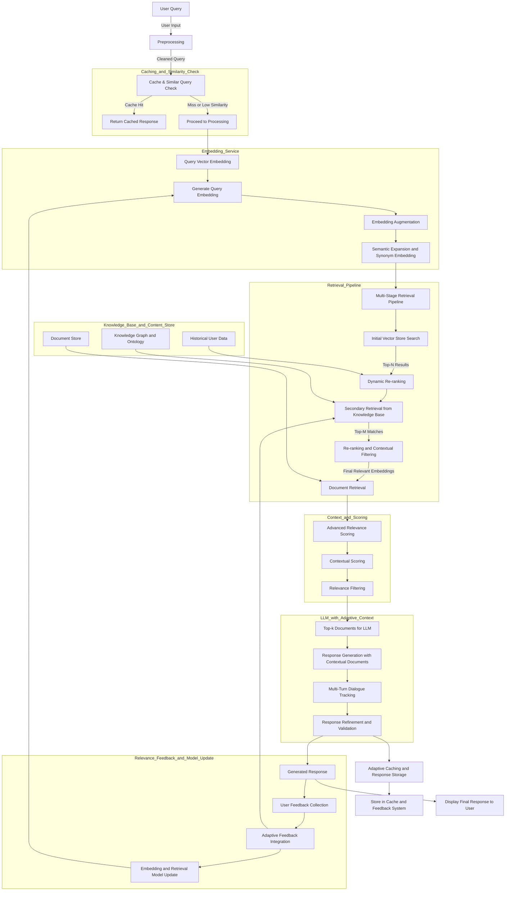

# Complex Retrieval-Augmented Generation (RAG) Pipeline Diagram

```mermaid
graph TD
  A[User Query] -->|User Input| B[Preprocessing]
  B -->|Cleaned Query| C[Cache & Similar Query Check]

  subgraph Caching_and_Similarity_Check
    C -->|Cache Hit| D[Return Cached Response]
    C -->|Miss or Low Similarity| E[Proceed to Processing]
  end

  E --> F[Query Vector Embedding]

  subgraph Embedding_Service
    F --> G[Generate Query Embedding]
    G --> H[Embedding Augmentation]
    H --> I[Semantic Expansion and Synonym Embedding]
  end

  I --> J[Multi-Stage Retrieval Pipeline]

  subgraph Retrieval_Pipeline
    J --> K[Initial Vector Store Search]
    K -->|Top-N Results| L[Dynamic Re-ranking]
    L --> M[Secondary Retrieval from Knowledge Base]
    M -->|Top-M Matches| N[Re-ranking and Contextual Filtering]
    N -->|Final Relevant Embeddings| O[Document Retrieval]
  end

  subgraph Knowledge_Base_and_Content_Store
    P[Knowledge Graph and Ontology] --> M
    Q[Historical User Data] --> L
    R[Document Store] --> O
  end

  O --> S[Advanced Relevance Scoring]

  subgraph Context_and_Scoring
    S --> T[Contextual Scoring]
    T --> U[Relevance Filtering]
  end

  U --> V[Top-k Documents for LLM]

  subgraph LLM_with_Adaptive_Context
    V --> W[Response Generation with Contextual Documents]
    W --> X[Multi-Turn Dialogue Tracking]
    X --> Y[Response Refinement and Validation]
  end

  Y --> Z[Adaptive Caching and Response Storage]
  Z --> AA[Store in Cache and Feedback System]
  Y --> AB[Generated Response]

  subgraph Relevance_Feedback_and_Model_Update
    AB --> AC[User Feedback Collection]
    AC --> AD[Adaptive Feedback Integration]
    AD --> AE[Embedding and Retrieval Model Update]
    AE --> G
    AD --> M
  end

  AB --> AF[Display Final Response to User]
```
